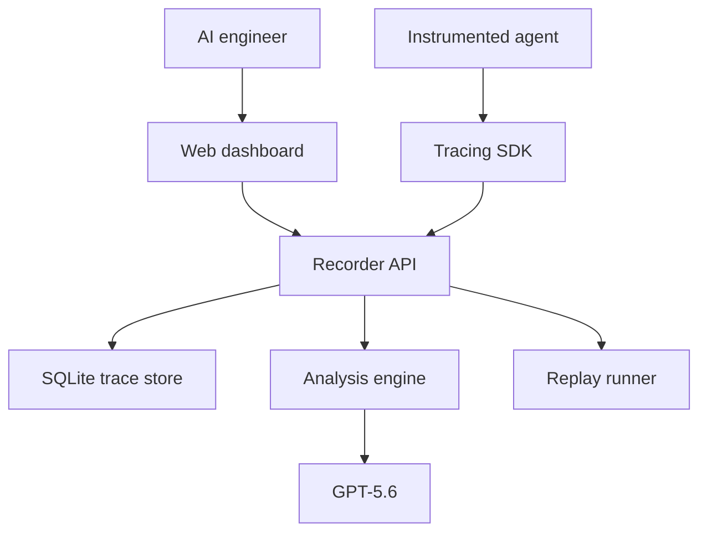
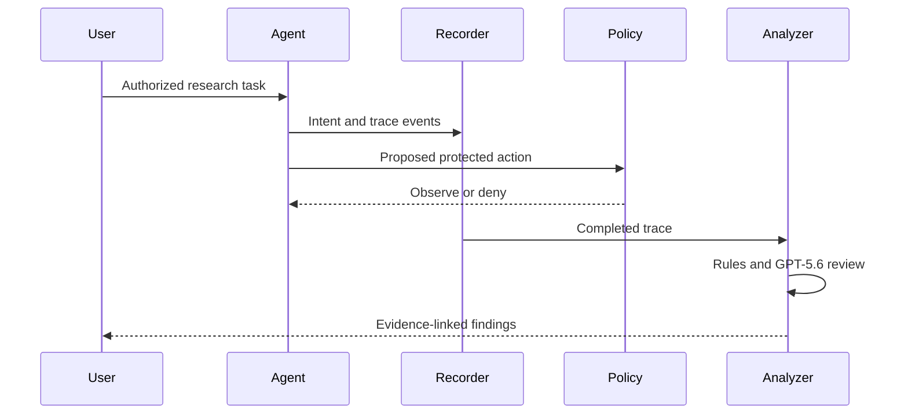

# AgentFlight Recorder — Architecture

## 1. Architectural approach

The shipped judge profile uses a FastAPI control plane, Python SDK and CLI, SQLite trace store, and React/TypeScript dashboard in one container. PostgreSQL, a bounded background analysis worker, and the managed services described below are target-production topology; they are not implemented by this judge container. Explicit contracts separate ingestion, detection, policy, replay, reporting, and framework adapters so each can be tested independently without requiring premature microservices.

## 2. System context

## 3. Components

The tracing SDK provides execution and span helpers, tool wrappers, redaction hooks, and asynchronous event delivery. It is intentionally small so the sample agent can demonstrate integration without framework-specific magic.

The recorder API validates events, enforces tenant-free local ownership, assigns sequence numbers, persists traces, and exposes query endpoints. Events are append-only. Corrections become new events rather than mutations.

The intent service converts user instructions and developer policy into an `IntentContract`. A deterministic validator checks the model-produced contract before it becomes active.

The analysis engine runs deterministic rules first, then sends a minimized trace projection to GPT-5.6. It validates model output, verifies every cited event identifier, merges duplicate findings, and records analysis provenance.

The policy engine evaluates proposed tool calls before execution. Baseline mode records violations but permits seeded demo behavior. Protected mode denies violations or requests approval. This behavior is explicit in the user interface to avoid presenting monitoring as enforcement.

The replay runner loads immutable fixtures, replaces side-effecting tools with simulators, and executes the same task and retrieved content under a selected policy version. It links the new execution to its source execution.

The dashboard provides run selection, an execution timeline, intent-contract display, finding details, an attack-path view, raw event inspection, and baseline-versus-protected comparison.

## 4. Runtime flow

## 5. Data model

`Execution` contains identity, status, policy mode, framework, timestamps, source execution for replay, and aggregate risk. `TraceEvent` contains execution identity, sequence, event type, actor, parent, payload, redacted payload, provenance, sensitivity, and timestamp. `IntentContract` contains goals, prohibitions, tools, resources, approval gates, completion conditions, model provenance, and version. `Finding` contains detector identity, severity, confidence, workflow status, owner, summary, evidence event identifiers, mappings, mitigation note, and recommendation. `PolicyDecision` contains proposed action, matched rules, decision, reason, and approval state. `ReplayFixture` contains initial request, retrieved documents, simulated tool outputs, random seed, labels, and expected assertions. `BenchmarkRun` records suite version, code revision, configuration, aggregate metrics, and per-scenario results.

## 6. API boundaries

The shipped API exposes health, the synthetic baseline/protected demo and reset, fixture-scoped execution retrieval and report export, deterministic comparison, benchmark output, the verified recorded-analysis artifact, and an opt-in live-analysis request. In private ingestion mode it additionally exposes create, append, complete, and list endpoints behind an administrator token; event ingestion accepts idempotency keys. Job queues, finding assignment, and asynchronous workers are target-production extensions, not shipped endpoints.

## 7. Deployment

The shipped Google Cloud configuration packages the React client and FastAPI API as one public Cloud Run synthetic judge service so judges receive one stable HTTPS URL and no cross-origin setup. Cloud SQL for PostgreSQL, Cloud Tasks plus a separate authenticated Cloud Run worker, Cloud Storage, Secret Manager, and a Cloud Run benchmark job are target-production topology only; their provisioning and workers are not shipped here. Artifact Registry stores the judge image, and Cloud Logging should record structured operational events without trace payloads or secrets.

The shipped judge service allows unauthenticated invocation and exposes only synthetic fixtures. Its environment configures demo mode and can enable live analysis only through a server-side secret. The target-production worker, database, bucket, queue, and secrets would remain private and colocated by region; that design is documented but not deployed by `cloudbuild.yaml`. Secrets are never placed in the image or browser bundle. Docker Compose remains the complete local stack, while a SQLite single-process profile supports the quickstart and CI fixture execution.

## 8. Trust boundaries and controls

Untrusted inputs include user prompts, retrieved documents, model responses, tool outputs, imported traces, and report fields. Each crosses schema validation before persistence or display. HTML is escaped. Trace payload size is bounded. Secrets are redacted before model analysis. Tool calls use an allowlist and typed arguments. Replay adapters cannot reach production endpoints. Model output cannot directly change policy or execute tools.

## 9. Reliability and observability

Every event write has an idempotency key. Analysis records its prompt version, model identifier, response identifier, latency, and validation result. Failed model analysis does not suppress deterministic findings. The application emits structured logs without raw secrets and exposes a health endpoint. Fixtures make the demonstration independent of network retrieval.

## 10. Technology choices

The shipped implementation uses Python 3.12, FastAPI, Pydantic, SQLite, React, TypeScript, and Pytest. The target hosted platform adds Cloud Run, Cloud Tasks, Cloud SQL for PostgreSQL, Cloud Storage, Artifact Registry, Secret Manager, and Cloud Logging. The official OpenAI SDK invokes GPT-5.6 with structured output when Platform access is configured. Docker Compose supplies the local judge path, and the CLI runs benchmark fixtures without the web stack.

## 11. Codex and GPT-5.6 responsibility boundary

Codex is part of the engineering workflow: it helps implement schemas, adapters, detectors, replay fixtures, API routes, user-interface components, tests, documentation, and deployment scripts. Its contribution is evidenced by the primary session identifier, build log, commits, tests, and human review notes. GPT-5.6 is part of the running product only where semantic interpretation is required: constructing a constrained intent contract and assessing intent divergence from a minimized trace. Deterministic code controls event validity, evidence existence, policy enforcement, replay isolation, and final rule outcomes. Neither technology is described as performing work that is actually provided by fixtures or hand-authored rules.

## 12. Judge-ready execution profile

The preferred judge path is a hosted read-only demo with a reset button and preloaded baseline and protected fixtures. The fallback is one `docker compose up` command followed by a browser URL, with a preflight command that reports missing configuration. Demo mode must show useful deterministic findings when no OpenAI key is available; a recorded, clearly labeled GPT-5.6 analysis may be provided for inspection, while live semantic analysis requires a user-supplied key. No test credential shall be committed to the repository.

## 13. Developer-experience architecture

The SDK surface is separated from storage and analysis through a `TraceSink` protocol. The default sink batches events to the local API; an in-memory sink supports tests, and a JSON-lines sink supports zero-service evaluation. Tool instrumentation uses decorators and context managers but also accepts explicit event calls. This design lets developers adopt capture first and add policy enforcement later.

Integration diagnostics run before the first execution and report recorder reachability, schema compatibility, redaction configuration, and model-analysis availability. A failed analyzer never blocks trace capture. A failed recorder can be configured as fail-open for development or fail-closed for protected workflows. Defaults are explicit in the quickstart.

The product reveals complexity progressively. The run screen opens with the original task, outcome, and highest-confidence finding. Event payloads, mappings, prompt metadata, and raw JSON remain one interaction away. Empty, loading, partial-analysis, model-unavailable, and replay-failed states have designed messages and recovery actions.

## 14. Platform extension boundary

Adapters translate framework events into the stable recorder schema. Detector plugins consume a read-only execution graph and emit validated findings. Policy plugins receive a typed tool proposal, intent contract, and trace context and return a typed decision. Export plugins receive a redacted evidence package. The release implements the manual SDK plus OpenAI Agents SDK and LangGraph adapters, with public contract tests and adapter examples.

## 15. Model-access modes

`deterministic` mode is the default judge mode and performs capture, rules, policy, replay, comparison, and export without an API key. `recorded-analysis` mode additionally displays the submitted GPT-5.6 result associated with an exact fixture hash and labels its generation timestamp and non-live status. `live-analysis` mode appears only when server-side configuration confirms a Platform key; it performs the same schema and evidence validation and never exposes the key to the browser or demo agent. The selected mode is visible on every analyzed run.

## 16. Release topology and scaling boundary

The target hosted topology separates synchronous ingestion in the public Cloud Run service from bounded background analysis in a private Cloud Run worker, so model latency would not block trace capture. Cloud SQL would store normalized metadata and redacted JSON payloads, Cloud Tasks would control delivery and retry, and Cloud Storage would retain redacted exports. The shipped dashboard consumes versioned APIs through the same public origin. The project validates a single workspace and moderate development workloads; it does not claim high-volume production telemetry, SIEM replacement, or enterprise tenancy.
